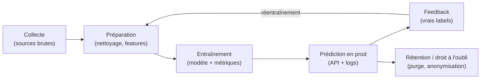

# Fiche — Cycle de vie et lignage de la donnée

> **Ressource transverse — culture + méthode.** Réf rapide : *d'où vient une
> donnée, par où elle passe, et comment prouver « quel modèle a été entraîné
> sur quelles données »*.
>
> Mobilisée en **M5** (documentation du déploiement), **M7-B1** (audit d'un
> système hérité) et dans le **journal de bord de certification** (consigner
> méthode et partis pris au fil de l'eau). Compagnon de la
> [`grille_decision_stockage.md`](./grille_decision_stockage.md) (où stocker)
> et de la [`cheatsheet_mlops_deploiement.md`](./cheatsheet_mlops_deploiement.md)
> (comment industrialiser).

---

## 0. Le cycle en un schéma

Une donnée n'est pas un stock : c'est un **flux** qui traverse le système, se
transforme à chaque étape, et finit par devoir **disparaître** (rétention,
droit à l'oubli). La boucle du bas (feedback → préparation) est ce qui fait
vivre le système — c'est la boucle de rétroaction de M6.

| Étape | Question à se poser | Trace attendue |
|---|---|---|
| **Collecte** | d'où ça vient ? qui fournit ? quel droit d'usage ? | source, date, format, contrat de données |
| **Préparation** | qu'a-t-on supprimé, imputé, transformé ? | script versionné + décisions documentées |
| **Entraînement** | quel jeu exact a produit ce modèle ? | version du jeu + métriques + date (tag/MLflow) |
| **Prédiction prod** | que reçoit et que renvoie le modèle ? | log des prédictions (entrées + sorties) |
| **Feedback** | comment récupère-t-on les vrais labels ? | table de feedback, date de labellisation |
| **Rétention / oubli** | combien de temps garde-t-on ? qui purge ? | durée de conservation + procédure de purge |

---

## 1. Lignage et traçabilité — de quoi on parle

- **Lignage (lineage)** : le **chemin** d'une donnée — de quelle source elle
  vient, quelles transformations elle a subies, dans quels produits (modèle,
  dashboard, API) elle a fini. Se lit dans les deux sens : *« d'où vient cette
  feature ? »* et *« si cette source change, qu'est-ce qui casse ? »*.
- **Traçabilité** : la capacité à **répondre avec preuves**. « Le modèle en
  prod est `v3`, entraîné le 12/06 sur `dataset_2026-06-10.csv` (SHA256 …),
  avec le script au tag `train-v3` » — chaque maillon est vérifiable.

Le minimum viable dans ce parcours n'exige **aucun outil dédié** :

| Maillon | Comment on le trace (parcours) |
|---|---|
| Le code de préparation / d'entraînement | commit + **tag git** |
| Le jeu de données | fichier figé + date dans le nom (+ SHA256 si sensible) |
| Le modèle | `model.joblib` + métadonnées (version, jeu source, métriques) ou MLflow |
| Les décisions humaines | `decisions.md` (M3) / journal de bord |

> 💡 **Réflexe certif** : le journal de bord *est* votre outil de lignage. Une
> ligne « 12/06 : retiré les 340 lignes sans label, choix documenté » vaut de
> l'or en soutenance — c'est la preuve que le parti pris est **conscient**.

---

## 2. Le contre-exemple : le legacy sans traçabilité

Le système hérité typique (celui que vous **auditez en M7-B1**) :

> Un `model_final_v2_OK.pkl` posé sur un serveur. Entraîné… un jour, par
> quelqu'un qui est parti, sur un extrait de base dont personne n'a gardé la
> version. Le script d'entraînement a été modifié depuis, sans commit. **Quel
> modèle a été entraîné sur quelles données ? Personne ne sait.**

Conséquences concrètes : impossible de **reproduire** le modèle, impossible de
savoir si une dérive vient des données ou du monde, impossible de **répondre à
un régulateur** (AI Act, RGPD), et un réentraînement devient un saut dans le
vide. Le coût de la traçabilité se paie en amont, en petits gestes ; son
absence se paie en aval, très cher — c'est un constat d'audit récurrent.

---

## 3. Contrat de données + fiche modèle (le pattern M3-B2)

Deux documents courts qui formalisent les **frontières** du cycle, vus en
M3-B2 :

- **Le contrat de données (data contract)** — côté *amont* : ce que la source
  s'engage à fournir (colonnes, types, contraintes, fréquence, qualité). Il
  protège la préparation : si la source dévie du contrat, on le **détecte**
  au lieu de le subir.
- **La fiche modèle (model card)** — côté *aval* : ce que le modèle attend en
  entrée, ce qu'il produit, sur quoi il a été entraîné, ses limites connues.
  Elle dit **pour quoi** on prépare les données, sans ouvrir le modèle.

> 💡 Ces deux docs sont le lignage **contractualisé** : ils rendent explicite
> ce qui, dans le legacy du § 2, n'existait que dans la tête de quelqu'un.

---

## 4. Versionner les données

Le code se versionne avec git — les données aussi, tant qu'elles restent
petites et **figées** :

- **Dans ce parcours** : jeux < quelques Mo, figés → **git suffit** (le CSV
  est commité, son état est lié au commit du code qui l'utilise). Pour un jeu
  non commitable (sensible, volumineux) : fichier daté + **SHA256** noté dans
  le README ou le journal.
- **À l'échelle** : quand les jeux pèsent des Go et évoluent, l'outil de
  référence est **DVC** (Data Version Control) — il versionne des pointeurs
  vers les données dans git et stocke les fichiers ailleurs. **Culture
  seulement ici** : on ne l'utilise pas dans le parcours, git couvre nos
  volumes (cf. l'encadré « outils d'entreprise » de la
  [`cheatsheet_mlops_deploiement.md`](./cheatsheet_mlops_deploiement.md)).

La règle qui compte, quel que soit l'outil : **un modèle référence toujours la
version exacte du jeu qui l'a produit.** Sans ça, pas de reproductibilité.

---

## 5. RGPD express : conservation et minimisation

Deux principes RGPD frappent directement le cycle de vie :

- **Minimisation** : ne collecter (et ne garder dans le jeu d'entraînement)
  que les données **nécessaires à la finalité**. Une colonne « au cas où » est
  un risque, pas un actif — elle se supprime à la préparation.
- **Conservation limitée** : une donnée personnelle a une **durée de vie
  définie à l'avance**. Le schéma du § 0 finit par « purge / anonymisation »
  parce qu'un droit à l'oubli exercé doit pouvoir se propager : logs de
  prédiction, tables de feedback, jeux d'entraînement archivés. Si personne ne
  sait où vit la donnée (pas de lignage), personne ne peut l'effacer.

> ⚠️ Le lignage n'est donc pas qu'une bonne pratique d'ingénieur : c'est une
> **condition de conformité**. « Où sont toutes les copies de cette donnée ? »
> est une question à laquelle un régulateur attend une réponse.

---

## 6. Où c'est mobilisé dans le parcours

| Moment | Geste |
|---|---|
| **M3** | `decisions.md`, contrat de données + fiche modèle (M3-B2), pseudonymisation |
| **M5** | documenter la chaîne déployée : quelle version de modèle, entraînée sur quoi |
| **M6** | boucle de feedback = nouvelles données à tracer (labels, dates, versions) |
| **M7-B1** | audit : reconstituer le lignage absent d'un système hérité |
| **M9 / certif** | journal de bord = méthode et partis pris consignés, datés, assumés |

---

## 7. À retenir

- La donnée est un **flux** : collecte → préparation → entraînement → prod →
  feedback → **purge**. Chaque étape laisse une trace, sinon le maillon est perdu.
- **Traçabilité** = pouvoir prouver « quel modèle, entraîné sur quelles données,
  avec quel code ». Le minimum : tags git + jeux figés datés + métadonnées modèle.
- **Contrat de données** (amont) + **fiche modèle** (aval) = le lignage
  contractualisé (pattern M3-B2).
- **git suffit** pour nos jeux petits et figés ; DVC est l'outil d'échelle
  (culture).
- RGPD : **minimiser** ce qu'on garde, **limiter** la durée — sans lignage, pas
  de droit à l'oubli possible.
- Le legacy sans traçabilité (M7) montre le vrai prix : irreproductible,
  inauditable, réentraînement à l'aveugle.

---

*Fiche pédagogique — Cycle de vie et lignage de la donnée. Compagnon de la
grille stockage et de la cheatsheet MLOps.*
