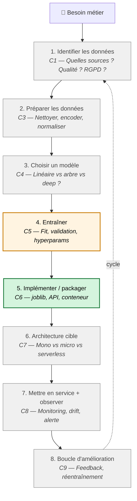
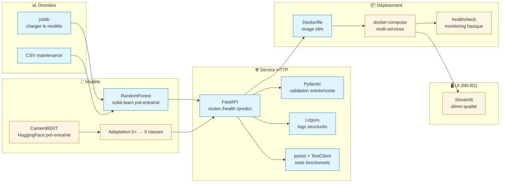
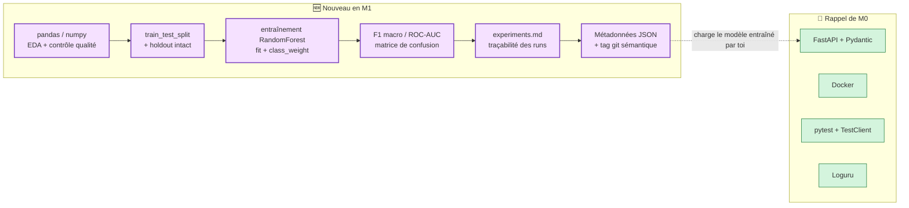

# Récap fin M0 → entrée M1

> Document de pont, à lire entre **vendredi soir M0** et **mardi 9h M1**.
> Objectif : que chacun visualise **où il est arrivé** et **où on va** avant
> de basculer dans M1.
>
> 📍 Lecture cible : **10-15 min**. À avoir sous la main pendant tout M1.

---

## 1. Le cycle ML — où on est dans la grande image

Le métier de concepteur·trice d'IA suit **8 grandes étapes**. Voici la
cartographie complète du parcours et de **ce que M0 a outillé**.

**Légende** :
- 🟢 **vert** = déjà outillé en M0 (étape 5 — palier C6 *imiter* puis *adapter*)
- 🟡 **orange** = nouveau en M1 (étape 4 — démarrage C5 *imiter*, C6 progresse en parallèle)
- ⚪ **gris** = à venir dans les modules suivants

> 💡 **La grande bascule M0 → M1** : en M0 tu **consommais** un modèle
> qu'on te livrait clé en main. En M1 tu vas **toi-même produire** le
> modèle, le packager, et le rendre consommable par d'autres. Tu changes
> de côté du miroir.

---

## 2. Les technos rencontrées en M0 — cartographie par couche

**Légende** :
- 🔵 **bleu** = vu en M0-B1 (IM Atlantique, maintenance prédictive individuel)
- 🟠 **orange** = ajouté en M0-B2 (Aubergine Hôtels, sentiment NLP binôme + async)

### Ce qui arrive en M1 (nouveau)

**Légende** :
- 🟣 **violet** = à découvrir en M1
- 🟢 **vert** = rappel de M0 (à rafraîchir avant lundi soir)

---

## 3. Les compétences — où tu en es, où tu vas

| Code | Compétence (intitulé court) | M0-B1 | M0-B2 | M1-B1 | M1-B2 |
| --- | --- | --- | --- | --- | --- |
| **C1** | Identifier les données | — | — | — | — |
| **C2** | Identifier les risques éthiques | — | — | — | — |
| **C3** | Préparer les données | — | — | — | — |
| **C4** | Choisir un modèle | — | — | — | — |
| **C5** | **Entraîner un modèle** | — | — | **▰▱▱ imiter** | **▰▰▱ adapter** |
| **C6** | **Implémenter une solution IA** | **▰▱▱ imiter** | **▰▰▱ adapter** | — | **▰▰▱ adapter** |
| **C7** | Concevoir une architecture | — | — | — | — |
| **C8** | Mesurer la performance | — | — | — | — |
| **C9** | Boucle d'amélioration continue | — | — | — | — |

**Lecture** :
- En M0 tu as démarré **uniquement C6** (implémenter) : tu as fait ▰▱▱
  *imiter* en M0-B1 (intégrer un modèle livré), puis ▰▰▱ *adapter* en
  M0-B2 (adapter le format de sortie 5⭐ → 3 classes).
- En M1 tu démarres **C5** (entraîner) en parallèle de la suite de C6,
  les deux progressent ensemble.
- Toutes les autres compétences arrivent **plus tard** dans le parcours
  (C1, C2, C3 surtout en M2-M3 ; C4 en M4 ; C7 en M7 ; C8-C9 en M5-M6).

> ⚠️ **C'est normal d'avoir l'impression de n'avoir « rien fait »** sur 7
> des 9 compétences à la fin de M0. La progression est **séquentielle et
> raisonnée** — on ne dispersera jamais l'attention sur 9 compétences en
> parallèle.

---

## 4. Vocabulaire — ce que tu manipules maintenant sans hésiter

À l'issue de M0, ces 15 termes devraient être en zone ☀️ *C'est clair*
sur ton mur réflexif. Si **3 ou plus** sont encore en 🌫️ *Flou*, signale-le
en RDV vendredi ou MP Discord avant mardi 9h.

| Famille | Termes |
|---|---|
| **API & HTTP** | endpoint, route, méthode HTTP (GET/POST), code statut (200/422/500), payload JSON |
| **FastAPI / Pydantic** | schéma Pydantic, validation, OpenAPI / `/docs`, lifespan |
| **Modèle** | modèle pré-entraîné, inférence, `.joblib`, chargement au démarrage |
| **Conteneurisation** | Dockerfile, image, conteneur, port, healthcheck |
| **Tests** | `TestClient`, fixture, assertion, test fonctionnel |
| **Logs** | log structuré, niveau (INFO/ERROR), Loguru, request_id |

---

## 5. Ce que M1 va t'apprendre (anticipation honnête)

À la fin de M1, ces **6 gestes** seront nouveaux :

1. **Charger un dataset tabulaire** avec pandas et faire une EDA minimale
   (distribution, corrélations, variable sensible).
2. **Splitter** correctement un dataset en train / test / holdout pour
   éviter de te mentir à toi-même.
3. **Entraîner** un modèle scikit-learn (`RandomForest.fit()`) sur un
   nouveau dataset, en gérant le déséquilibre (`class_weight`).
4. **Choisir et lire** les bonnes métriques pour une classification
   déséquilibrée (F1 macro, ROC-AUC, matrice de confusion — **pas
   l'accuracy**).
5. **Tracer tes expérimentations** avec un fichier `experiments.md`
   versionné (alternative simple à MLflow).
6. **Versionner ton modèle** avec métadonnées JSON + tag git sémantique
   pour préparer la chaîne CI/CD qui viendra en M5.

> 💡 Les gestes M0 (FastAPI, Pydantic, Docker, tests, Loguru) seront
> **rejoués** en M1-B2 mais sur **ton propre modèle** — pas un modèle
> livré. C'est la différence fondamentale.

---

## 6. Checklist de transition (à cocher avant mardi 9h)

- [ ] J'ai relu mon `README.md` M0-B1 et je sais expliquer en 3 phrases
      ce que fait l'API.
- [ ] J'ai relu mon `README.md` M0-B2 et je sais expliquer le mapping
      5⭐ → 3 classes.
- [ ] Je sais relancer **mes deux APIs M0** (B1 et B2) en < 5 min.
- [ ] J'ai parcouru ce récap et j'ai identifié **les 3 termes** qui me
      semblent les plus flous (à pointer en RDV vendredi).
- [ ] J'ai lu le carnet d'entrée M1 (`M1_avant-module.md`) distribué
      sur Discord J-5.
- [ ] Mon environnement Python répond au sanity check du carnet M1.

---

## 7. Pour aller plus loin (optionnel, 30 min max)

- **Le cycle ML en image** (Google Developers — *ML development phases*) —
  schéma 4 phases : <https://developers.google.com/machine-learning/managing-ml-projects/phases>
- **scikit-learn — *Getting Started*** :
  <https://scikit-learn.org/stable/getting_started.html> — 10 min, juste
  pour voir la grammaire `fit / predict / score`.
- **Le mini-cours `00_competences_referentiels.md`** dans ce même
  dossier — pour comprendre la grille complète CISIA + OPCO ATLAS.

---

*Récap fin M0 → entrée M1 — v1.0, 2026-05-27*
